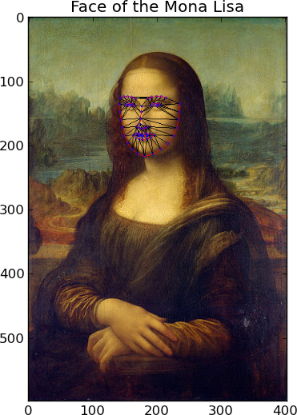

.. _tutorial:

Tutorial
========

The following tutorial shows how to detect a face in an
image using `FaceTracker`. The complete demo can be found
in the examples folder of the source distribution:

Filename: :file:`examples/face_image.py`

First we need to import the `facetracker` package::

  >>> import facetracker

To create the tracker with need to pass it the face model
file::

  >>> tracker = facetracker.FaceTracker(r'..\external\FaceTracker\model\face.tracker')

The tracker requires a gray scale image. We use the `PIL`
package to load an image and transform it to gray scale::

  >>> img = Image.open(img_path)
  >>> gray = img.convert('L')
  >>> gray = np.asarray(gray)

The last statement converts the `PIL` image into a numpy
array which is the format required by the tracker.
The tracker uses a window size to determine the STD of each
feature. The ``setWindowSizes`` accepts a tuple of window
sizes. The values should be sorted from high to low::

  >>> tracker.setWindowSizes((11, 9, 7))

The face detection is invoked by the ``update`` method of
the tracker::

  >>> tracker.update(gray)

The ``update`` method returns ``True`` on success. The
estimated face coordinates can be drawn on the image using
the ``draw`` method. The ``draw`` method accepts a RGB image
and two numpy arrays describing the connection and triangulation
of the model::

  >>> conns = facetracker.LoadCon(r'..\external\FaceTracker\model\face.con')
  >>> trigs = facetracker.LoadTri(r'..\external\FaceTracker\model\face.tri')
  >>> img = tracker.draw(img, conns, trigs)

The image space coordinates of the face features can be retrieved
using the ``get2DShape`` method. The 3D coordinates of the features
can be retrieved using the ``get3DShape`` method::

  >>> obj3D = tracker.get3DShape()
  >>> fig3d = plt.figure()
  >>> ax = fig3d.add_subplot(111, projection='3d')
  >>> ax.scatter(obj3D[:66, 0], obj3D[66:132, 0], obj3D[132:, 0])

.. image:: ../images/3DMonaLisa.png
   :align: center
   :scale: 80

More examples can be found in the source distribution under the
:file:`examples/` folder.
